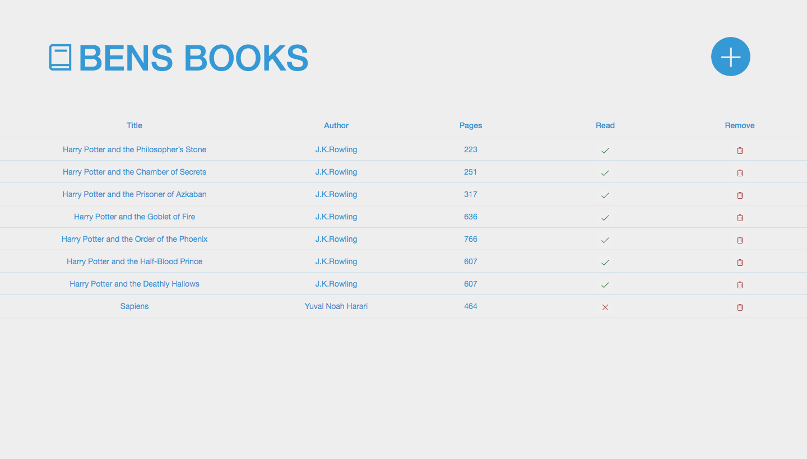

# 

# Bens Books Library WebAPP

This project was completed for The Odin Project JavaScript Library Assignment. 

This is soley created using Vanilla JS. 

The aim of the project was to create a library web app that you could add and delete books aswell as changing the read status. ideally making use of the concepts of Prototypal inheritance and the Constructor function.

This is a complete and fully functionnal Persoanl WebApp Library, where i can manage my own Library (Add, Edit, Delete books). All my data is synced and stored in a database using Google's mobile and web application development platform [Firebase](https://firebase.google.com/).

To see the full list of the project outlines along with other submission visit the assignment page [The Odin Project: JavaScript Library](https://www.theodinproject.com/courses/javascript/lessons/library?ref=lnav)

  

## Table of contents

1. [Demo](#demo)
2. [Technologies](#technologies)
3. [Features](#features)
4. [Development](#development)
5. [License](#license)

## Demo

Here is the working live demo:
[https://benjamin-gambling.github.io/library/](https://benjamin-gambling.github.io/library/).

## Technologies

- Javascript modules, ES6, Bootstrap, Line Awesome Icons
- [Bootstrap](https://getbootstrap.com/)
- [Firebase Database](https://firebase.google.com/products/database/)

  
  

## Features
- Data storing & synchronisation ([Firebase Database](https://firebase.google.com/products/database/))
- Manage your Library by adding, edit & removing your books
- When adding book you can give a star rating along with comments but does not display yet
- Simple design
- Currently only design for my personal use and for others to view and play with through GitHub

### Devlopment
- Make more mobile user friendly/Make mobile app
- Make the comments and rating visable and edited 
- Add sorting and search features
- Add Firebase Auth so everyone can have their own acount with thier own library changing 'Bens' to users first name with login credentials w/ Secure User Authentification ([Firebase Authentication](https://firebase.google.com/products/auth/))
- Improve design to resond with added features w/ Firebase UI ([FirebaseUI](https://github.com/firebase/firebaseui-web))

## License

> You can check out the full license [here](LICENSE)

This project is licensed under the terms of the **MIT** license.